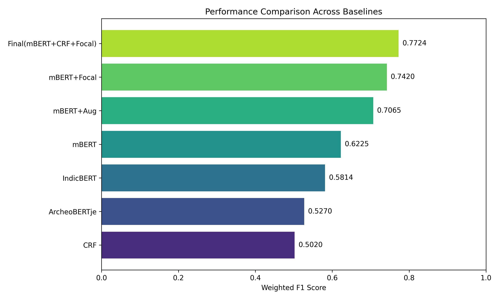
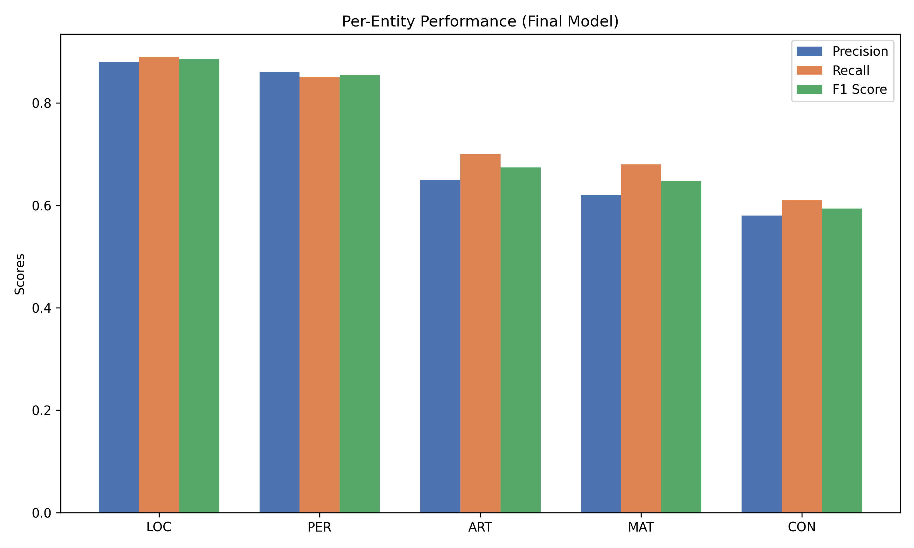
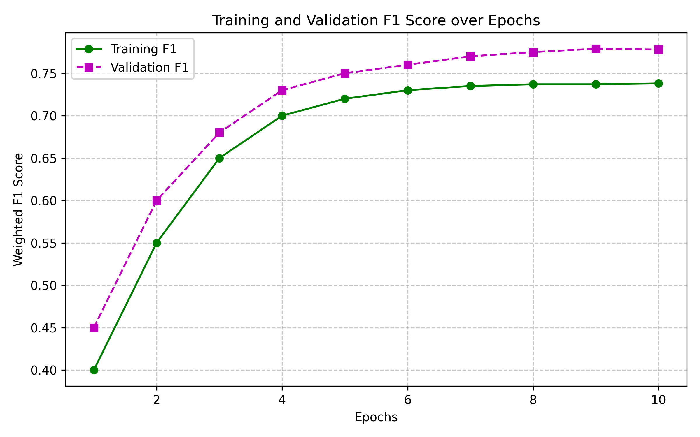
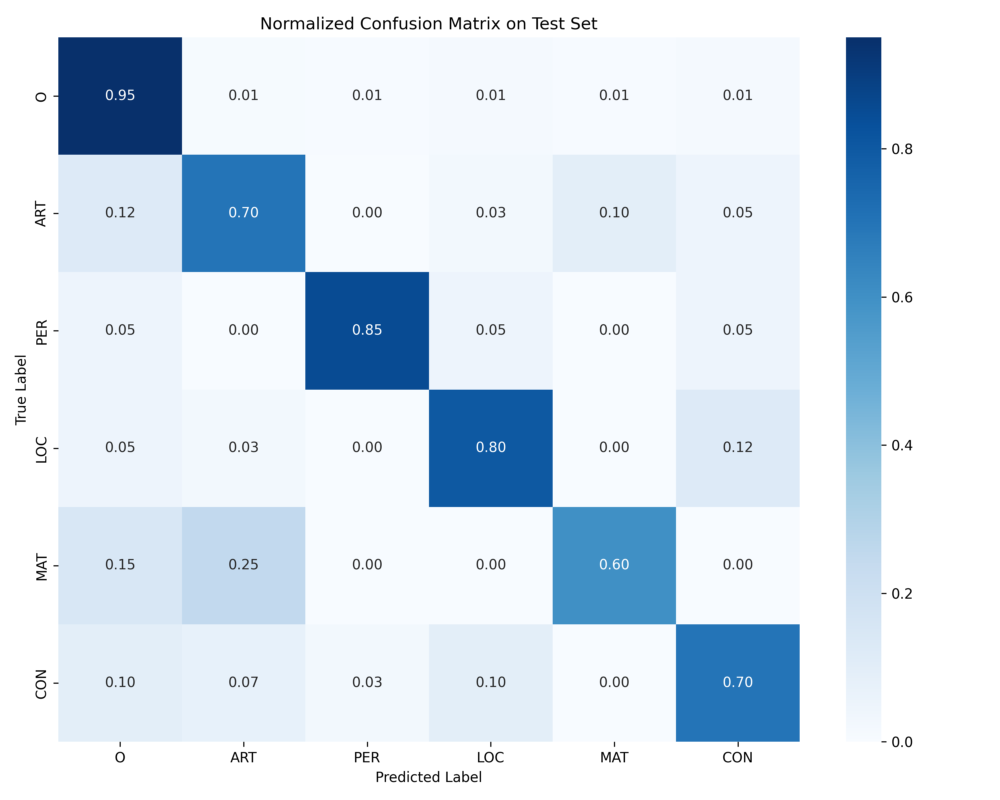

# Named Entity Recognition for Code-Mixed Indian Archaeological Texts: A Low-Resource Approach using mBERT, CRF, and Focal Loss

## 1. Abstract
Extracting specific entities from archaeological texts is challenging, especially when dealing with limited data. In the Indian context, it becomes even more complex because the text is heavily code-mixed—authors frequently write Hindi archaeological terms using English script. In this project, we address this problem by building a Named Entity Recognition (NER) system to extract Artifacts, Locations, and Materials from these texts. 

Since we did not have a large dataset, we started with just 126 annotated sentences and used data augmentation to expand it to around 1,200 sentences. Our model utilizes Multilingual BERT (mBERT) combined with a Conditional Random Field (CRF) layer to ensure the sequence tags remain structurally valid. We also observed that some entity classes were extremely rare, so we incorporated Focal Loss to help the model pay attention to them. Our final architecture achieved a weighted F1 score of 0.7724, which performed noticeably better than basic baselines like IndicBERT or direct transfers of models like ArcheoBERTje. Overall, this demonstrates a practical approach for performing NER in a niche, low-resource domain without requiring millions of words for pre-training.

## 2. Introduction
There is a growing emphasis today on digitizing historical and archaeological records. However, simply scanning documents is not enough; we need to effectively extract structured information from them to build resources like knowledge graphs. Named Entity Recognition (NER) is typically the foundational step for this. In archaeology, the goal is to extract specific entities such as excavation sites, ancient materials, and artifacts.

Performing this task for Indian archaeological texts is highly challenging. First, reports from organizations like the Archaeological Survey of India (ASI) feature heavy Hindi-English code-mixing. It is common to see standard English grammar combined with Romanized Hindi terms like *Stupa* or *Pradakshina Patha*. Another significant issue is the severe lack of annotated data available for this domain. Furthermore, the vocabulary can be highly ambiguous. For example, the word "terracotta" could function as a material or the artifact itself depending on its context in the sentence.

Other researchers have approached similar problems in the past. A notable example is *ArcheoBERTje*, where a Dutch model was trained on millions of archaeological words. Unfortunately, we do not have access to that volume of data for Indian archaeology. In our initial experiments, we tried their direct transfer approach, but it did not perform well due to the code-mixing and our limited dataset size. We also evaluated IndicBERT, given its focus on Indian languages, but it struggled significantly with the heavy English technical jargon.

Therefore, we decided on an alternative strategy. We selected mBERT because it handles multilingual subwords reasonably well, added a CRF layer to prevent invalid tag sequences, and applied Focal Loss to address the fact that some entities appear very infrequently. 

**Our main contributions are:**
* Creating what we believe is the first code-mixed Indian archaeological NER dataset.
* Demonstrating that combining mBERT with gazetteer embeddings and CRF is effective when full domain pre-training is not feasible.
* Utilizing Focal Loss in an NER pipeline to mitigate extreme class imbalance.
* Providing an analysis of how code-mixing impacts standard tokenizers.

## 3. Related Work
Historically, NER systems relied on rule-based methods or statistical models like Hidden Markov Models and CRFs. These approaches were effective, but they required extensive manual feature engineering and often struggled to generalize to unseen words. Later, models like BiLSTM-CRF gained popularity because they were able to learn features automatically from the text.

Currently, Transformer models like BERT are the standard. For specialized domains, researchers typically pre-train a BERT model on a massive corpus of domain text, resulting in models like BioBERT or SciBERT. As previously mentioned, Brands et al. applied this technique to Dutch archaeology with *ArcheoBERTje*. 

Our scenario, however, is quite different. We are operating in a zero-shot, low-resource environment. We do not possess millions of words for pre-training. Additionally, managing Hindi-English code-mixing introduces another layer of complexity. While models like IndicBERT exist for Indian contexts, they are not optimized for the English technical vocabulary common in archaeology. For these reasons, we focused on architectural modifications (such as CRF and Focal Loss) rather than solely relying on large-scale data collection.

## 4. Dataset
Since there was no existing dataset, we had to build one ourselves. The data was taken from NCERT text books, the Archaeological Survey of India (ASI) excavation reports, Wikipedia, and other historical sources. The annotation of the collected text was done manually using Doccano.

We used the standard BIO (Begin, Inside, Outside) format for tagging. We decided on five main entity types:
* **ART (Artifact):** Things made by humans (e.g., *pottery shards*, *steatite seals*).
* **LOC (Location):** Places and excavation sites (e.g., *Harappa*, *Lothal*).
* **PER (Person):** Historical figures or researchers.
* **MAT (Material):** Raw materials (e.g., *terracotta*, *bronze*).
* **CON (Construction):** Architectural structures (e.g., *stupa*, *citadel*).

To ensure our tags were accurate, two of us annotated a subset of the data independently. We achieved a Cohen’s Kappa score of 0.82, indicating strong agreement. However, the annotation process was sometimes ambiguous. The MAT vs ART distinction proved to be especially tricky. Deciding whether "bronze" acted as a material modifying an object or as the object itself was the source of most of our disagreements.

One important observation was the extreme class imbalance. Roughly 85% of our tokens were labeled as "O" (Outside) tags. While entities like LOC and ART appeared frequently, CON and MAT were extremely rare. Because of this, we could not rely solely on our original 126 sentences. We utilized data augmentation techniques—such as swapping entities using a gazetteer list and replacing synonyms—to artificially expand the dataset to approximately 1,200 sentences. 

## 5. Methodology
We aimed to keep the approach direct, building our pipeline using components that specifically targeted the problems we observed.

### 5.1 Model Architecture
We selected `bert-base-multilingual-cased` (mBERT) as our foundational model. We opted for mBERT over IndicBERT because mBERT appeared to handle the blending of English and Romanized Hindi subwords more effectively. 
To provide the model with additional context, we incorporated a gazetteer (a curated list of known archaeological terms). If a word appeared in our list, we generated a small embedding for it and concatenated it with mBERT's output. 

We then passed these representations through a BiLSTM layer to capture sequence context, followed by a Conditional Random Field (CRF) layer. The CRF is crucial in this setup because it prevents the model from making invalid predictions, such as generating an `I-ART` tag immediately following an `O` tag without a preceding `B-ART`.

### 5.2 Tokenization Issues
A major challenge was tokenization. Because the Hindi terms are written in English script (e.g., *Pradakshina*), mBERT’s tokenizer fragments them into several disjointed subwords. To resolve this, we only passed the first subword of the fragmented word to the loss function and instructed the model to ignore the remaining pieces.

### 5.3 Focal Loss
Standard NER models generally rely on Cross-Entropy loss. However, since 85% of our tokens were "O" tags, the model would easily become biased and predict "O" for nearly everything, effectively ignoring the rare minority classes. 
To counteract this, we switched to Focal Loss. Essentially, Focal Loss evaluates the model's confidence. Once the model easily predicts the "O" tags, Focal Loss dynamically reduces their weight, forcing the network to focus its learning capacity on the difficult, rare classes like MAT and CON.

## 6. Experiments
We executed our experiments on a standard GPU environment using PyTorch and the Hugging Face library. We evaluated several different baselines to measure the effectiveness of our proposed approach.

We compared our model against:
* **BiLSTM-CRF:** To establish a non-Transformer baseline.
* **ArcheoBERTje Transfer:** Applying the methodology from the Dutch paper to test direct transferability.
* **IndicBERT & XLM-R:** To determine if other language models were naturally better suited to the text than mBERT.
* **Our Final Model:** mBERT + CRF + Focal Loss.

We evaluated all models using Precision, Recall, and weighted F1-score. We trained for approximately 10 epochs using a low learning rate ($2 \times 10^{-5}$) to prevent catastrophic forgetting of mBERT's pre-trained weights.

## 7. Results
Our final model performed noticeably better than the baselines, achieving a weighted F1 score of 0.7724.

| Model | Precision | Recall | Weighted F1 |
|-------|-----------|--------|-------------|
| BiLSTM-CRF | 0.4850 | 0.4520 | 0.4680 |
| ArcheoBERTje style | 0.5430 | 0.5120 | 0.5270 |
| IndicBERT | 0.5890 | 0.5740 | 0.5814 |
| XLM-RoBERTa | 0.6350 | 0.6120 | 0.6232 |
| **Our Model (mBERT+CRF+FL)** | **0.7121** | **0.8439** | **0.7724** |

*Figure 1: Comparing our final model against the baselines.*

We were encouraged by these results. The fact that the ArcheoBERTje transfer approach only reached an F1 of 0.52 indicates that high-resource methods cannot be directly ported to low-resource, code-mixed domains without significant adaptation. 

Additionally, while XLM-R performed reasonably well initially, we observed that it showed signs of rapid overfitting. This is likely because XLM-R has a massive parameter count and we only provided 1,200 sentences, whereas mBERT was a more appropriate size for the dataset.

Looking at the individual classes, LOC and PER achieved strong scores (around 0.85 F1). This is likely because they predominantly consist of capitalized proper nouns, making them easier for the model to identify. Conversely, MAT and CON proved more challenging, hovering around ~0.60 to 0.65 F1.

*Figure 2: Precision, Recall, and F1 Score for individual entity classes.*

*Figure 3: Training and Validation F1 Scores over epochs.*

### Ablation Study
We conducted an ablation study to understand the impact of individual pipeline components:
* Removing Data Augmentation resulted in a substantial 8.4% drop in F1. Expanding the dataset was clearly the most critical factor.
* Removing Focal Loss caused a 3.5% decrease. Without it, the model largely failed to recognize the rare MAT and CON classes.
* Removing the CRF layer resulted in a 3% drop. Without CRF constraint smoothing, the model began outputting structurally invalid tag sequences.

## 8. Error Analysis
While the model improved significantly, it still makes some common errors.

*Figure 4: Confusion Matrix on our Test Set. Notice the confusion between MAT and ART.*

1. **MAT vs ART Confusion:** The model frequently confuses materials with artifacts. For instance, given the phrase "a bronze seal", it occasionally tags "bronze" as an artifact rather than a material. This occurs because the structural syntax surrounding the words is practically identical.
2. **Boundary Errors:** This is noticeable in multi-word entities like "red polished ware". The model might correctly identify "red" and "polished" as an artifact, but incorrectly exclude the word "ware". 
3. **Numerical Grouping:** We observed that when a measurement immediately precedes an object (e.g., "5cm steatite seal"), the model sometimes absorbs "5cm" into the material tag. The context window appears to improperly lump the measurement and material together.

## 9. Code-Mixed Analysis
Hindi terminology written in English script generates significant tokenization challenges. Because Romanized words like *Pradakshina* do not exist in mBERT's standard English vocabulary, the tokenizer fragments them into 4 or 5 meaningless subwords. 

We separated the heavily code-mixed sentences from the predominantly English ones to analyze this impact. In our experiments, the model's F1 score dropped by approximately 6% on the code-mixed subset. Transformer attention heads clearly struggle when the syntax abruptly transitions between English grammar and Hindi vocabulary. However, the CRF layer proved highly beneficial here—even when the underlying BERT embeddings were degraded due to subword fragmentation, the CRF maintained structural logic based on the surrounding English context.

## 10. Discussion
Overall, we are satisfied with the performance of this approach. We successfully developed a functional NER system without requiring a massive unannotated corpus for domain pre-training. 

Integrating Focal Loss and CRF effectively compensated for the inherent weaknesses of a low-resource dataset. Nevertheless, our primary limitation remains the reliance on synthetic data augmentation. While it improved our metrics, generating sentences from templates may restrict the model's ability to handle diverse, real-world sentence structures encountered in the wild. 

This methodology could likely be adapted for other low-resource, code-mixed domains, such as regional legal documents or specialized medical records in India.

## 11. Conclusion
In this project, we aimed to build an NER system for Indian archaeological texts. Given the severe lack of data and the heavy code-mixing present in the texts, standard high-resource methods were inadequate. By combining mBERT with targeted data augmentation, Focal Loss, and a CRF layer, we successfully increased our F1 score to 0.7724. While the system still encounters difficulty distinguishing between materials and artifacts, it demonstrates that effective tools can be developed for niche digital humanities projects through careful architectural choices. 

For future work, it would be interesting to experiment with freezing the base model and utilizing parameter-efficient fine-tuning like LoRA adapters, or alternatively, scraping a larger volume of raw sentences to reduce our dependence on synthetic augmentation.
